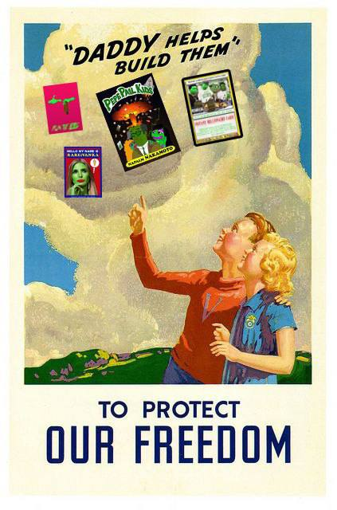

# Fake Rares & Commons

In April of 2018 the [Rare Pepe Scientists](../the-rare-pepe-blockchain-project/rare-pepe-scientists.md) retired and left us with years of pondering what the next step in evolution would be, for frogs and dankness in general. After all, many Pepes were left on the sidelines because they couldn’t get submitted in time or were rejected by the Scientists, or were just created pre- or post-Rare Pepe, but still had some memetic appeal to them.

Which is why the [Fake Rare Directory](https://fakeraredirectory.wordpress.com/) and the [Dank Directory ](https://www.dankdirectory.io/)were created.

The [Fake Rare Pepe movement](https://fakeraredirectory.com/about/) started in September of 2021 when [@ScrillaVentura](https://twitter.com/ScrillaVentura), an OG Rare Pepe artist, broke the rules of the Official Rare Pepe Telegram by sharing an asset that was not an official Rare Pepe (the community called these assets “Fake Rares” which, until recently, was perhaps a tastefully derogatory term). Rightfully so, this troll was temporarily banned from the Telegram group, prompting him to start his own... [BEWARE OF FAKE RARES](https://t.me/OFFICIALFAKERARES). The Fake Rare that started it all, fondly referred to as the “Proof of Ban” card, later became the first official Fake Rare, S0 C0, the [FREEDOMKEK](https://pepe.wtf/asset/FREEDOMKEK).&#x20;

While born from a troll, Fake Rares is a love letter to Rare Pepes and a continuation of that legacy. By design, Fake Rares pay homage to Rare Pepes with the structure, the rules, and the way we approach the entire ecosystem. Though curated much like Rare Pepes, the Fake Rare directory is decentralized for the most part (at least where it counts, as there are no fees) and the mechanism for publication is based on a community-derived, deflationary asset. The unofficial official first Fake Rare, S1 C1, was [FAKEASF](https://pepe.wtf/asset/FAKEASF), which was created by the community and airdropped in batches of 20 to the first 100 people who joined the telegram group.&#x20;

.gif>)

The “Fake Scientists” believe that Rare Pepes, and now Fake Rares, reflect the broader thesis and showcase the narrative of Bitcoin in a compelling way, highlighting sovereignty, provenance, immutability, and the trustless dissemination of information, beliefs, and culture.  Pepes are a conduit for the transmission of this narrative, and as they evolve, have begun to bridge the gap and expand beyond the intimate community, igniting the Summer of Pepe in 2022 with an all-stars [Series 8](https://fakeraredirectory.com/series-8/) [curated by Vincent Van Dough](https://twitter.com/Vince\_Van\_Dough/status/1541599342590537729).

[Joe Looney](https://twitter.com/wasthatawolf), the creator of the [RarePepeWallet](https://rarepepewallet.com/), also created the [FakeRareWallet](https://fakerarewallet.com/), for the purposes of the Fake Rare Pepe movement.

The wallet’s website properly displays all Fake Rare Pepes the user has in their possession (even if they’re animated, which is a nice touch), which isn’t the case with RarePepeWallet, as it only properly displays the original Rare Pepes.
